# Installation d'un firewall sur le GOAD :  

Un membre du groupe est certifié Stormshield et est amème de configurer un firewall pour protéger le GOAD depuis l'extérieur.
Comme nous l'avons montré sur le schéma réseau nous avons placé le firewall en sortie du GOAD entre la DMZ et et le réseau local.

La matrice des flux 

 

| Source/Dest | 9200   | 8220   | 9997   | 80     | 443    | 53     |
|-------------|--------|--------|--------|--------|--------|--------|
| Internet    | x      | x      | x      | Allow  | Allow  | x      |
| DNS         | x      | x      | x      | x      | x      | Allow  |
| Wazuh       | x      | x      | x      | x      | Allow  | x      |
| Elastic     | Allow  | Allow  | x      | x      | x      | x      |
| Splunk      | x      | x      | Allow  | x      | x      | x      |

Pour le firewall j'utilise une OVA obtenue en passant les exams Stormshield : 

Voici la page de connexion : 

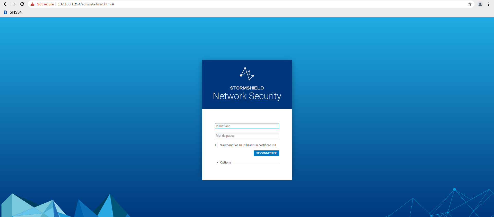

Une fois connecté je modifie l'accès au page d'administration : 

Je spécifie uniquement les réseaux internes à l'accès à l'administrateur (DMZ + GOAD)

Création des objets machines  :
### Kingslanding   
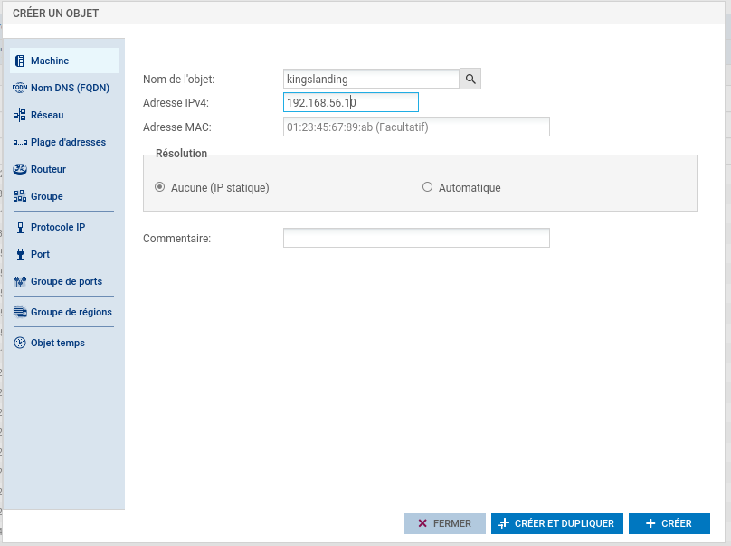

### Castelblack 

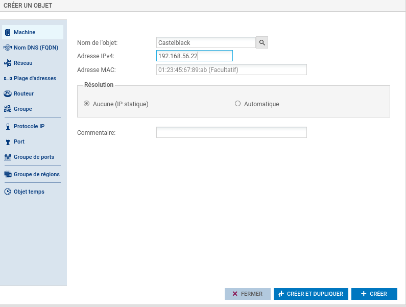

### Winterfell

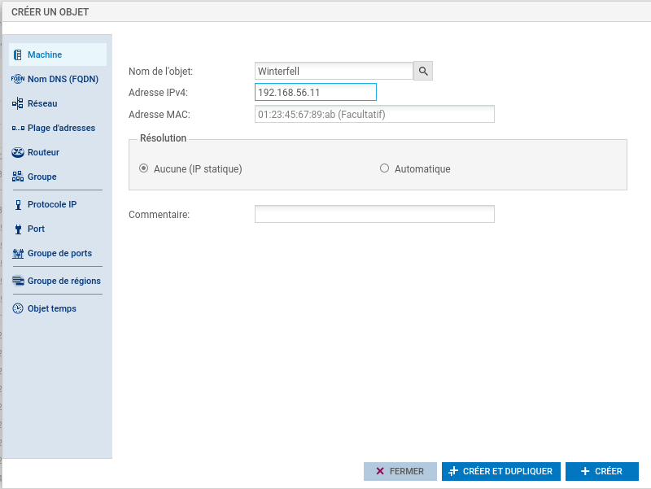

### Merren

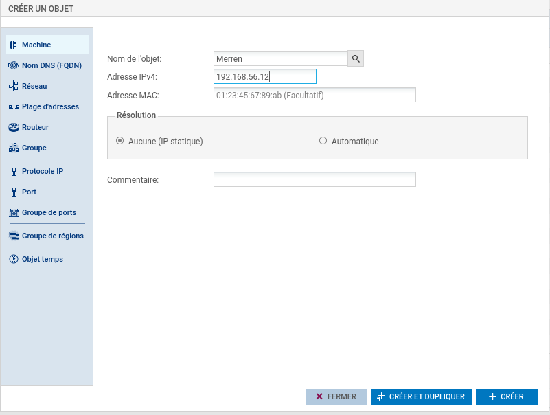

### Braavos 

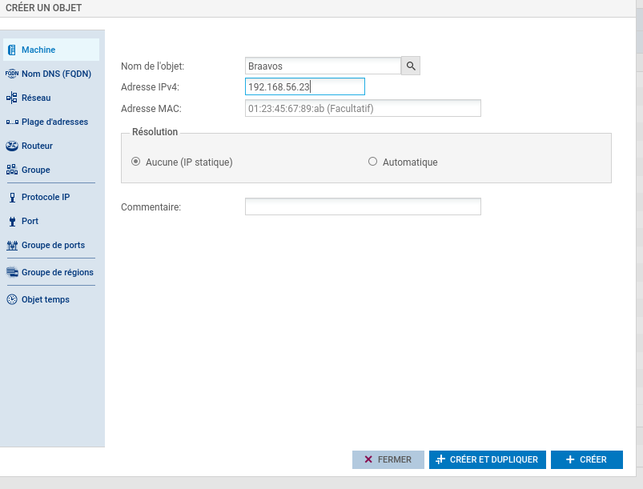

Voici tous les objets machine créés  : 

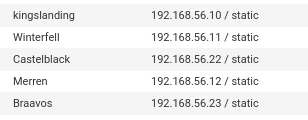

Création des objets en rapport avec le port  : 

### Splunk 

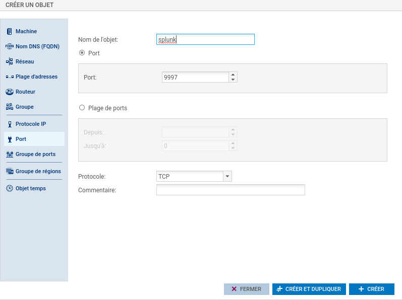

### Wazuh
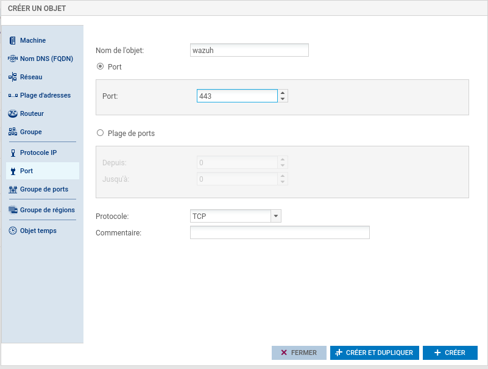

### Elastic 
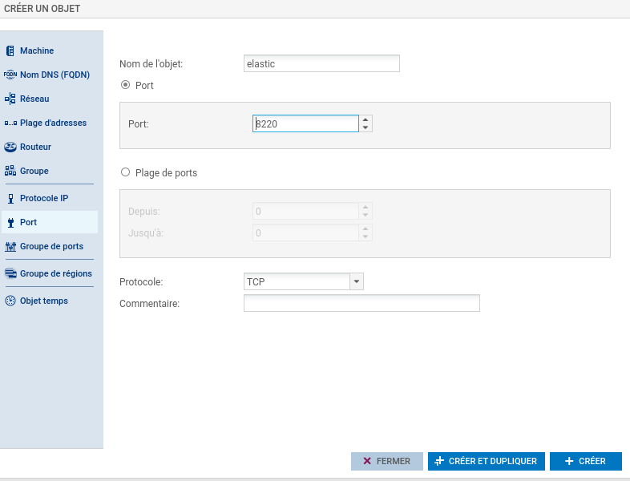

Une fois tous les objets machines créés, nous allons mettre en place les règles NAT et de filtrage pour autoriser le trafic souhaité :

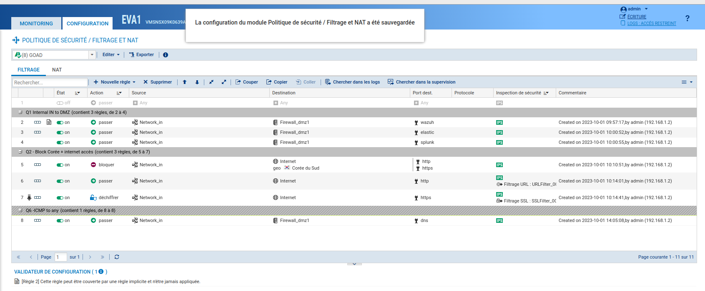

Nous avons accepter les requêtes du réseau interne à la DMZ  sur les ports des SIEMS, nous avons autorisé l'accès à Internet en HTTP et HTTPS (avec déchiffrement SSL). Nous avons bloqué les sites coréens (pour flex sur le Firewall)

Après quelques tentatives de connexion sur des sites coréens (visitekorea.or.kr) on remarque que la règle s'active  : 

Nous n'allons pas mettre plus de configurations dans le firewall.

Voici le firewall installé  : 
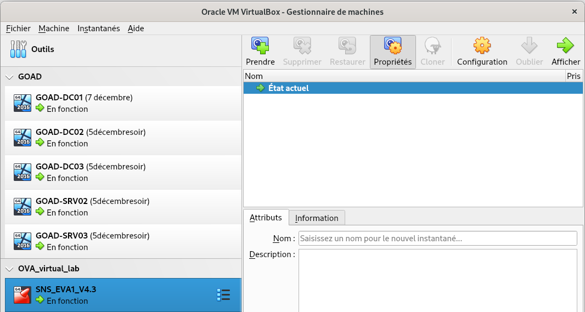
