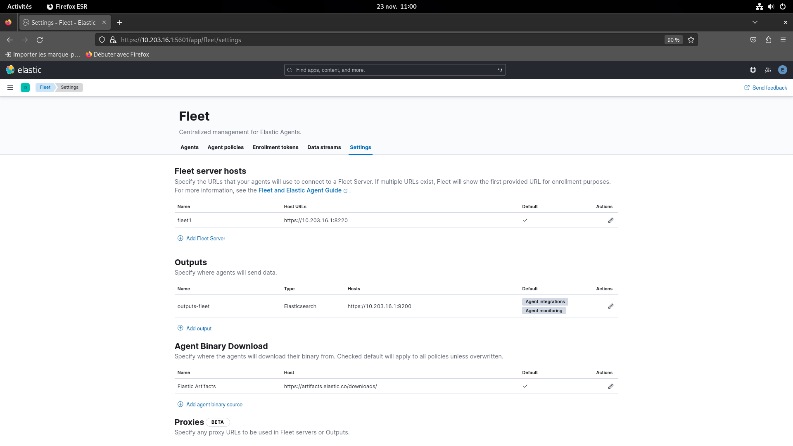

# Installation de Elastic 

### Installation de docker et make :

    sudo apt install docker.io make

### Git clone :

    git clone https://github.com/pushou/siem.git

### Modification du fichier sysctl.conf

    sudo nano /etc/sysctl.conf
        -> vm.max_map_count=262144

### Vérification de la modification

    sysctl -p   

### Ajout de l'utilisateur dans le groupe docker
    sudo apt install usermode
    sudo usermod test -aG docker   
    sudo reboot

### installation des environements
    
    cd siem
    make es
    make siem
    make fleet

### Lire les mots de passes :
    make pass
        /home/test/siem/scripts/print_password.sh
        password elastic= jTblnAiH3VX*nmw+xWS0
        password kibana= 38lOi2159xiizKTo3RzU
        password beats_system= nop6UcZiyHSb7Cdh2jL=
        password apm_system=  nop6UcZiyHSb7Cdh2jL=
        password remote_monitoring_user= 68DfsgTYJQSbeE97e3e_

### Dans un navigateur :
    https://10.203.16.1:5601

Authentification : 
    
    login : elastic
    mot de passe : jTblnAiH3VX*nmw+xWS0

  

