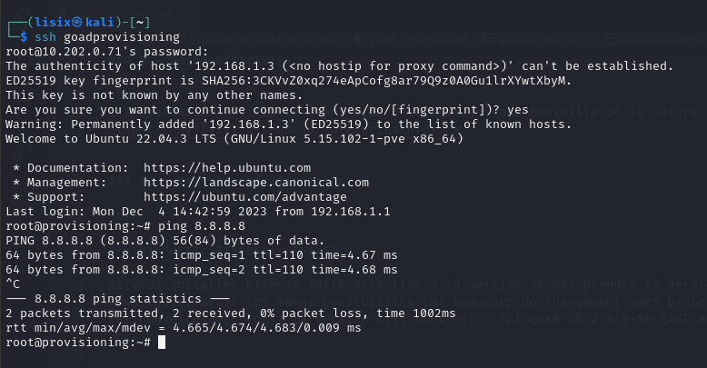
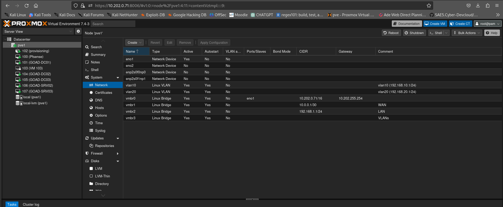
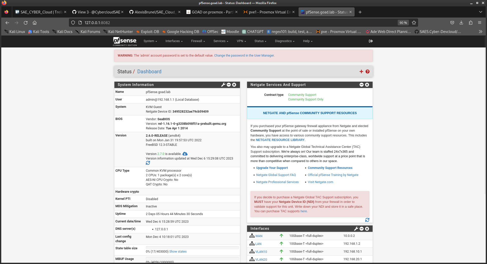

# ONAY Ilker RT3


## Installation GOAD sur proxmox


### I - Guide officielle 

<br>
L'installation officielle étant bien détaillée je vous conseille de le suivre
https://mayfly277.github.io/categories/proxmox/


### II - Note et spécifications

<br>

**<ins>Partie Pfsense:</ins>**

Si vous installer Pfsense faire attention à la version ne pas prendre la dernière si vous voulez avoir les mêmes possibilités car beaucoup de changement sont présent dans les nouvelles versions, la version utilisées est : "pfSense-CE-2.6.0-RELEASE-amd64.iso"
<br><br>


```
iptables -t nat -A POSTROUTING -o vmbr0 -j SNAT -s 10.0.0.0/30 --to-source [IP_PROXMOX]

```

<br>

Utiliser pour le CT provisionning la template `ubuntu-22.04-standard_22.04-1_amd64.tar.zst` plutôt que `ubuntu-22.10-standard_22.10-1_amd64.tar.zst`
car il y'a beaucoup de problème de paquets sur la version proposer
<br><br>



<br>

**<ins>Partie Ansible:</ins>**

Mettre a jour les paquets python pour Ansible
<br><br>


**<ins>Partie VPN:</ins>**
<br>

La parti VPN est facultatif

### III - Fin






