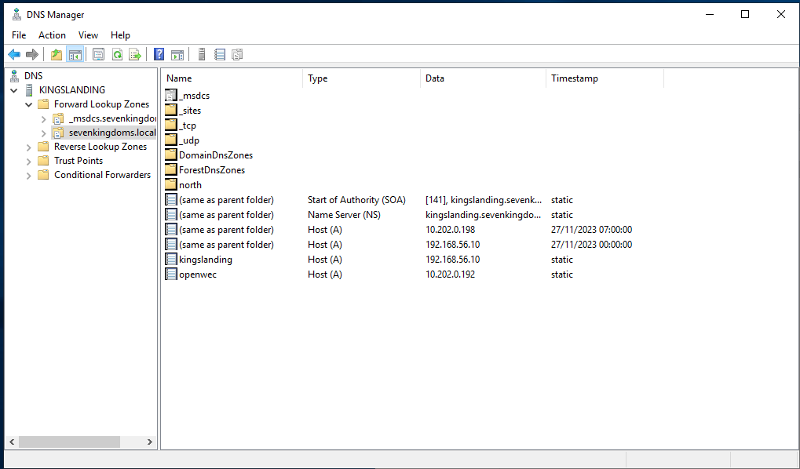

# Installation d'openwec

Installation des paquets et début du déploiement: <br>

```
apt install libclang-dev libkrb5-dev libgssapi-krb5-2 sqlite msktutil
adduser openwec
cargo build --release
cp ./target/release/openwecd /usr/local/bin/
cp ./target/release/openwec /usr/local/bin/
```
<br><br>

```
systemctl edit openwec.service --full --force

Fichier : 

### openwec.service
[Unit]
Description=Windows Events Collector
After=network.target
[Service]
Type=simple
User=openwec
Restart=always
RestartSec=5s
ExecStart=/usr/local/bin/openwecd -c /etc/openwec/openwec.conf.toml
[Install]
WantedBy=multi-user.target

```

<br><br>

Ajout des droits au fichier 

```
chown -R openwec.openwec /var/db/openwec
```

<br><br>

Configuration d'openwec ( ne pas oublier de crée /var/db/openwec) 
<br><br>

```
# /etc/openwec.conf.toml
[logging]
logging = "info"
[server]
verbosity = "info"
db_sync_interval = 5
flush_heartbeats_interval = 5
keytab = "/etc/openwec.keytab"
[database]
type = "SQLite"
# You need to create /var/db/openwec yourself
path = "/var/db/openwec/db.sqlite"

[[collectors]]
hostname = "openwec.sevenkingdoms.local"
listen_address = "0.0.0.0"

[collectors.authentication]
type = "Kerberos"
service_principal_name = "HTTP/openwec.sevenkingdoms.local@SEVENKINGDOMS.LOCAL"

```
<br><br>
Création du lien entre fichier
```
ln -s /etc/openwec/openwec.conf.toml /etc/openwec.conf.toml
```
<br><br>
Initialisation de la bdd
```
openwec -c /etc/openwec/openwec.conf.toml db init
```

<br><br>

Config openwec avec xml

```
wget https://raw.githubusercontent.com/ANSSI-FR/guide-journalisation-microsoft/main/Standard_WEC_query.xml

openwec -c /etc/openwec/openwec.conf.toml subscriptions new anssi-subscription ./Standard_WEC_query.xml

openwec subscriptions edit anssi-subscription outputs add --format json files /openwec/logssho

openwec subscriptions enable anssi-subscription
```
<br><br>

Modifications du fichier host

```
#/etc/hosts
127.0.0.1       localhost
127.0.1.1       Debian-Berra
10.202.0.192    openwec.sevenkingdoms.local
10.202.0.164    north.sevenkingdoms.local
10.202.0.198    sevenkingdoms.local
10.202.0.133    essos.local
10.202.0.199    essos.local
10.202.0.155    north.sevenkingdoms.local

# The following lines are desirable for IPv6 capable hosts
::1     localhost ip6-localhost ip6-loopback
ff02::1 ip6-allnodes
ff02::2 ip6-allrouters
```


<br><br>
Sur le terminal  windows : <br>

```
gpedit.msc
```
<br><br>

Computer Configuration > Policies > Windows Settings > Security Settings > System Services > Windows Remote Management (WS-Management), et selectionné "Automatic" startup mode

Puis ,  Computer Configuration > Policies > Administrative Templates > Windows Components > Event Forwarding > Configure target Subscription Manager , selectionner Enabled puis, Show

<br>
Mon "show": 
<br>
<br>


<br><br>
Puis depuis le "DNS Manager"

Ajouter openwec 




<br><br>
Puis depuis le "Active Directory"

Ajouter un utilisateur openwec 


<br><br>

Une fois  qu'on crée l'utilisateur maintenant il faut le lier avec le SPN

```
setspn -S HTTP/openwec.sevenkingdoms.local openwec

setspn -L openwec
```
<br><br>
Génération du keytab sur le DC 


```
ktpass -princ
HTTP/openwec.sevenkingdoms.local@JMP.LOCAL -mapuser openwec -crypto ALL -mapop set -
ptype KRB5_NT_PRINCIPAL -pass openwec -target sevenkingdoms.local -kvno 0
-out c:\Users\vagrant\Desktop\openwec.keytab
```
<br><br>
On déplace la clef sur l'openwec dans l'emplacement pré-déclarer.


Pour tester a la fin le bon fonctionnement 

```
lsiof -i :5985
/usr/local/bin/openwecd -c /etc/openwec/openwec.conf.toml
tcpdump

```


retour 
```

12:04:38.489116 IP 10.202.0.162.1514 > north.sevenkingdoms.local.49859: Flags [.], ack 6606, win 9647, options [nop,nop,sack 1 {5146:5672}], length 0
12:04:38.489661 IP north.sevenkingdoms.local.49859 > 10.202.0.162.1514: Flags [P.], seq 6606:7616, ack 90, win 8206, length 1010
12:04:38.524063 IP north.sevenkingdoms.local.49859 > 10.202.0.162.1514: Flags [P.], seq 6606:8066, ack 90, win 8206, length 1460
12:04:38.524604 IP 10.202.0.162.1514 > north.sevenkingdoms.local.49859: Flags [.], ack 8066, win 9647, options [nop,nop,sack 1 {6606:7616}], length 0
12:04:38.524629 IP 10.202.0.162.1514 > north.sevenkingdoms.local.49859: Flags [.], ack 8066, win 9647, options [nop,nop,sack 1 {6606:7616}], length 0
12:04:38.525071 IP north.sevenkingdoms.local.49859 > 10.202.0.162.1514: Flags [P.], seq 8066:8572, ack 90, win 8206, length 506
12:04:38.549591 IP openwec.sevenkingdoms.local.ssh > 10.202.0.131.41960: Flags [.], seq 16904:18352, ack 1, win 501, options [nop,nop,TS val 650689195 ecr 2768253690], length 1448
12:04:38.549626 IP openwec.sevenkingdoms.local.ssh > 10.202.0.131.41960: Flags [P.], seq 18352:18492, ack 1, win 501, options [nop,nop,TS val 650689195 ecr 2768253690], length 140
12:04:38.550336 IP 10.202.0.131.41960 > openwec.sevenkingdoms.local.ssh: Flags [.], ack 18492, win 4961, options [nop,nop,TS val 2768253793 ecr 650689195], length 0
12:04:38.551852 IP north.sevenkingdoms.local.49859 > 10.202.0.162.1514: Flags [P.], seq 8066:8572, ack 90, win 8206, length 506
12:04:38.552249 IP 10.202.0.162.1514 > north.sevenkingdoms.local.49859: Flags [.], ack 8572, win 9647, options [nop,nop,sack 1 {8066:8572}], length 0
12:04:38.552270 IP 10.202.0.162.1514 > north.sevenkingdoms.local.49859: Flags [.], ack 8572, win 9647, options [nop,nop,sack 1 {8066:8572}], length 0
12:04:38.552749 IP north.sevenkingdoms.local.49859 > 10.202.0.162.1514: Flags [P.], seq 8572:9050, ack 90, win 8206, length 478
12:04:38.553071 IP 10.202.0.162.1514 > north.sevenkingdoms.local.49859: Flags [.], ack 9050, win 9647, length 0
12:04:38.553090 IP 10.202.0.162.1514 > north.sevenkingdoms.local.49859: Flags [.], ack 9050, win 9647, length 0
12:04:38.568616 IP north.sevenkingdoms.local.49859 > 10.202.0.162.1514: Flags [P.], seq 9050:9544, ack 90, win 8206, length 494
12:04:38.569186 IP 10.202.0.162.1514 > north.sevenkingdoms.local.49859: Flags [.], ack 9544, win 9647, length 0
12:04:38.569210 IP 10.202.0.162.1514 > north.sevenkingdoms.local.49859: Flags [.], ack 9544, win 9647, length 0
12:04:38.584952 IP north.sevenkingdoms.local.49859 > 10.202.0.162.1514: Flags [P.], seq 9544:10038, ack 90, win 8206, length 494
12:04:38.585450 IP 10.202.0.162.1514 > north.sevenkingdoms.local.49859: Flags [.], ack 10038, win 9647, length 0
12:04:38.585473 IP 10.202.0.162.1514 > north.sevenkingdoms.local.49859: Flags [.], ack 10038, win 9647, length 0
12:04:38.653579 IP openwec.sevenkingdoms.local.ssh > 10.202.0.131.41960: Flags [.], seq 18492:19940, ack 1, win 501, options [nop,nop,TS val 650689299 ecr 2768253793], length 1448
12:04:38.653611 IP openwec.sevenkingdoms.local.ssh > 10.202.0.131.41960: Flags [P.], seq 19940:20560, ack 1, win 501, options [nop,nop,TS val 650689299 ecr 2768253793], length 620
12:04:38.654334 IP 10.202.0.131.41960 > openwec.sevenkingdoms.local.ssh: Flags [.], ack 20560, win 4961, options [nop,nop,TS val 2768253897 ecr 650689299], length 0
```
<br><br>


On répétent l'opération sur les autres DC et SRV GOAD


