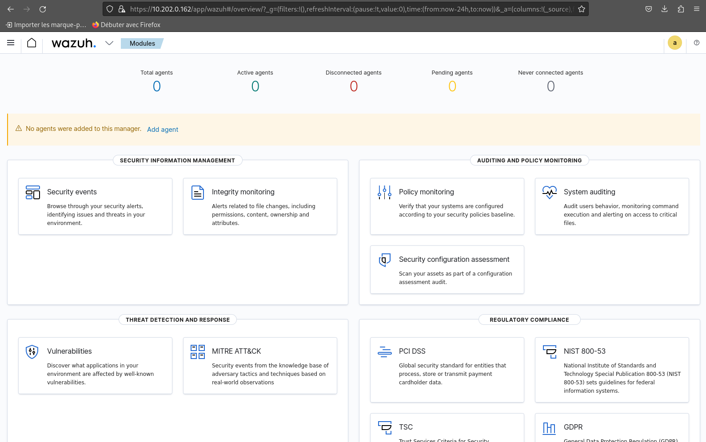
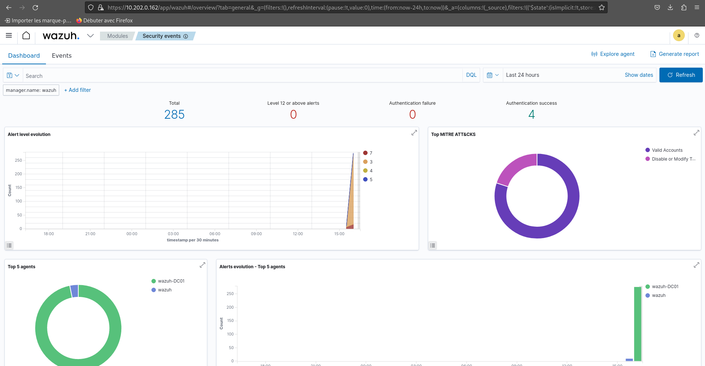
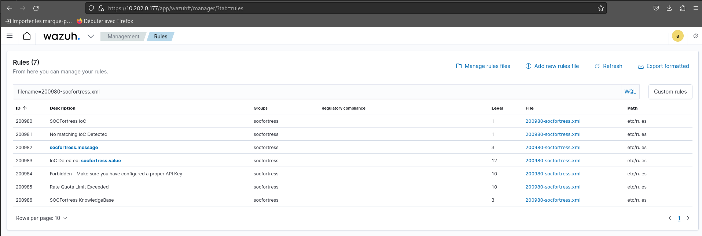

# Déploiement de Wazuh

## Installaion du Serveur Wazuh

### Indexer Wazuh 

#### 1. Configuration initiale

    mkdir wazuh
    cd wazuh
    curl -sO https://packages.wazuh.com/4.7/wazuh-install.sh
    curl -sO https://packages.wazuh.com/4.7/config.yml
    nano config.yml
        -> remplacer <indexer-node-ip> et <dashboard-node-ip> par l'ip serveur 10.202.0.162

    sudo bash wazuh-install.sh --generate-config-files -i

#### 2. Installation des nodes Wazuh indexer  
    curl -sO https://packages.wazuh.com/4.7/wazuh-install.sh
    sudo bash wazuh-install.sh --wazuh-indexer node-1 -i

#### 3. Initialisation du cluster
    sudo bash wazuh-install.sh --start-cluster -i 

#### Test de l'installation du cluster
    su root
    tar -axf wazuh-install-files.tar wazuh-install-files/wazuh-passwords.txt -O | grep -P "\'admin\'" -A 1

Résultats :

    indexer_username: 'admin'
    indexer_password: 'tZvVIA??A?HHJXD77osHh46GeoCYfd.J'
 

    curl -k -u admin:tZvVIA??A?HHJXD77osHh46GeoCYfd.J https://10.202.0.162:9200

Résultat :

    {
    "name" : "node-1",
    "cluster_name" : "wazuh-indexer-cluster",
    "cluster_uuid" : "vlKoyoprQ3GnGlUM3-eVZQ",
    "version" : {
        "number" : "7.10.2",
        "build_type" : "rpm",
        "build_hash" : "db90a415ff2fd428b4f7b3f800a51dc229287cb4",
        "build_date" : "2023-06-03T06:24:25.112415503Z",
        "build_snapshot" : false,
        "lucene_version" : "9.6.0",
        "minimum_wire_compatibility_version" : "7.10.0",
        "minimum_index_compatibility_version" : "7.0.0"
    },
    "tagline" : "The OpenSearch Project: https://opensearch.org/"
    }

 

    curl -k -u admin:tZvVIA??A?HHJXD77osHh46GeoCYfd.J https://10.202.0.162:9200/_cat/nodes?v

Résultat :

    ip      heap.percent ram.percent cpu load_1m load_5m load_15m node.role node.roles
            cluster_manager name
    10.202.0.162            4          79   2    0.00    0.09     0.09 dimr      data,ingest,master,remote_cluster_client *               node-1

 

### Serveur Wazuh

#### Installation du cluster Wazuh  

    curl -sO https://packages.wazuh.com/4.7/wazuh-install.sh
    sudo bash wazuh-install.sh --wazuh-server wazuh-1 -i

 

### Installation du tableau de bord Wazuh

#### Téléchargement de l'assisatnt d'installation Wazuh

    curl -sO https://packages.wazuh.com/4.7/wazuh-install.sh

#### Lancement l'assistant avec l'option --wazuh-dashboard

    sudo bash wazuh-install.sh --wazuh-dashboard dashboard -i

Résultat :

    INFO: --- Summary ---
    INFO: You can access the web interface https://10.202.0.162:443
        User: admin
        Password: tZvVIA??A?HHJXD77osHh46GeoCYfd.J
    INFO: Installation finished.

#### Afficher tout les utilisateurs avec leurs mot de passe 

    sudo tar -O -xvf wazuh-install-files.tar wazuh-install-files/wazuh-passwords.txt

Résultats :

    # Admin user for the web user interface and Wazuh indexer. Use this user to log in to Wazuh dashboard
    indexer_username: 'admin'
    indexer_password: 'tZvVIA??A?HHJXD77osHh46GeoCYfd.J'

    # Wazuh dashboard user for establishing the connection with Wazuh indexer
    indexer_username: 'kibanaserver'
    indexer_password: '6YVwGI3njx4PJrgjIDKOtk?5q5RdMyh4'

    # Regular Dashboard user, only has read permissions to all indices and all permissions on the .kibana index
    indexer_username: 'kibanaro'
    indexer_password: 'joH?f8Ihq*a7?8ZS22aXMqUE1a*yyl.h'

    # Filebeat user for CRUD operations on Wazuh indices
    indexer_username: 'logstash'
    indexer_password: 'jVnIKXbfuadNrWJfP2n.Ty4x*NbQEjmw'

    # User with READ access to all indices
    indexer_username: 'readall'
    indexer_password: 'i2KDVFw.3KeYo?zwVFsJc3XtxbxD9juR'

    # User with permissions to perform snapshot and restore operations
    indexer_username: 'snapshotrestore'
    indexer_password: 'HQmgdCqpkStxo2N7TjRjN7VVDB13*v+T'

    # Password for wazuh API user
    api_username: 'wazuh'
    api_password: '4xDvuuzP*r7Ztyj.bqX9uolUY+8zFJle'

    # Password for wazuh-wui API user
    api_username: 'wazuh-wui'
    api_password: 'OL1fvoGOoutMWck+oFz1bVqOqvJIWx8.'

 

#### Accès à l'interface web :

    URL: https://10.202.0.162

    Username: admin

    Password: tZvVIA??A?HHJXD77osHh46GeoCYfd.J

Preuve :

 
 

## Déploiement des agents Wazuh sur les machines du GOAD

### Sur l'interface web :

    Add agent > Windows

    Server Adresse :
        10.202.0.162
    
    Agent name :
        agent-dc-un

    Select groups :
        default

### Sur la machine Windows du GOAD :

#### Téléchargement et installation de l'agent wazuh :

    Invoke-WebRequest -Uri https://packages.wazuh.com/4.x/windows/wazuh-agent-4.7.0-1.msi -OutFile ${env.tmp}\wazuh-agent; m
    
    siexec.exe /i ${env.tmp}\wazuh-agent /q WAZUH_MANAGER='10.202.0.162' WAZUH_AGENT_GROUP='default' WAZUH_AGENT_NAME='agent-dc-un' WAZUH_REGISTRATION_SERVER='10.202.0.162' 

#### Démarrage de l'agent 

    NET START WazuhSvc

 
Fonctionnement de l'agent :

Nous avons déployer l'agent de cette manière sur les 3 DC du GOAD !

## Ajout de règles 

Nous avons choisis de rajouter des règles de sécurité nommés socfortress :

    curl -so ~/wazuh_socfortress_rules.sh https://raw.githubusercontent.com/socfortress/Wazuh-Rules/main/wazuh_socfortress_rules.sh && bash ~/wazuh_socfortress_rules.sh

Nous voyons bien les nouvelles règles dans Wazuh :

