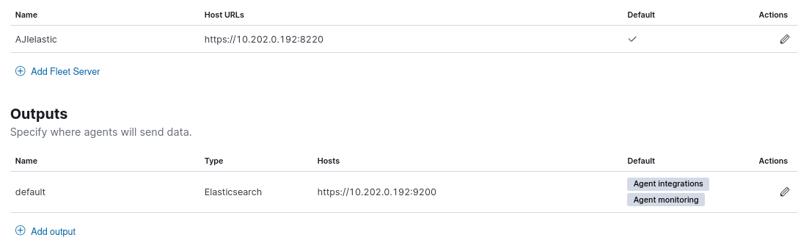
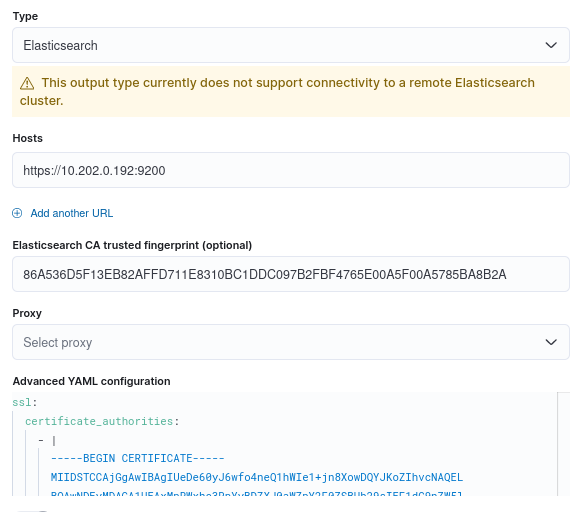
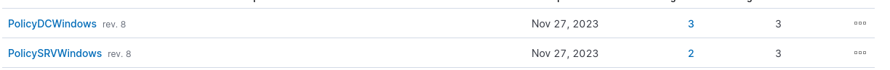
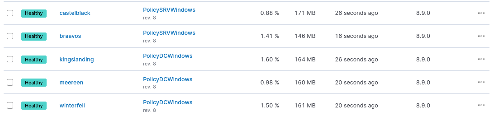
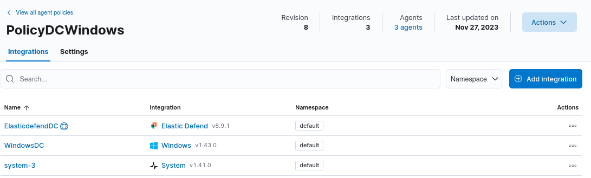
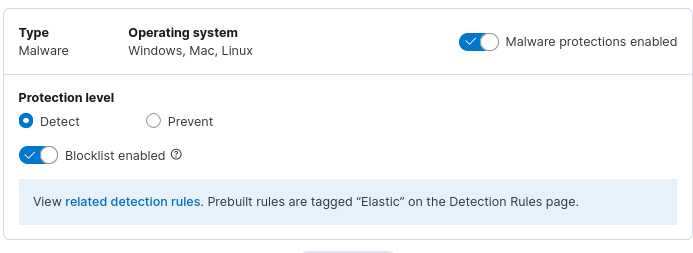
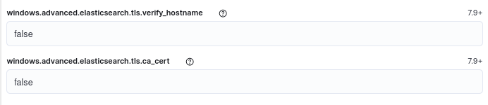
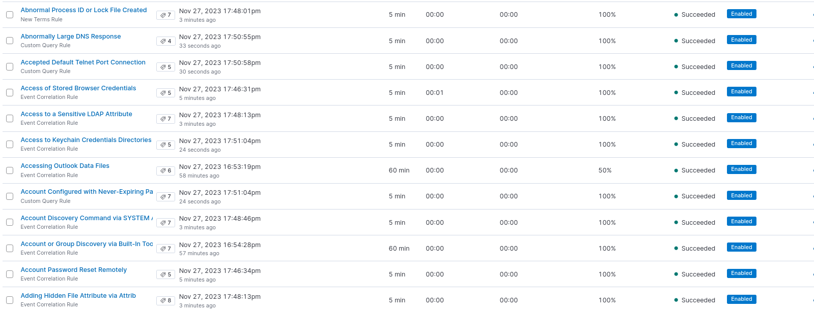
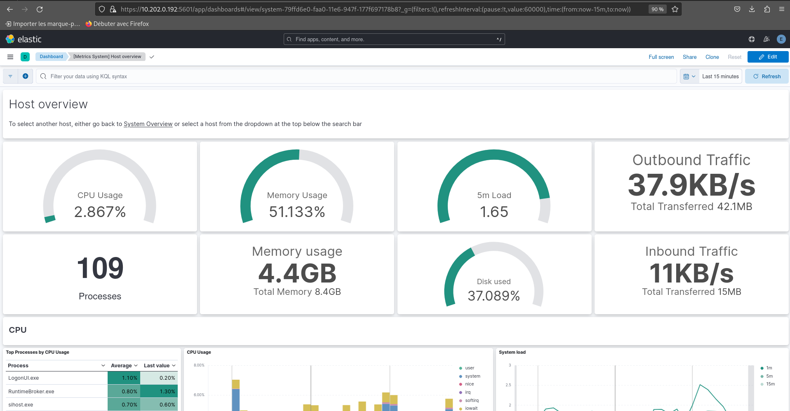
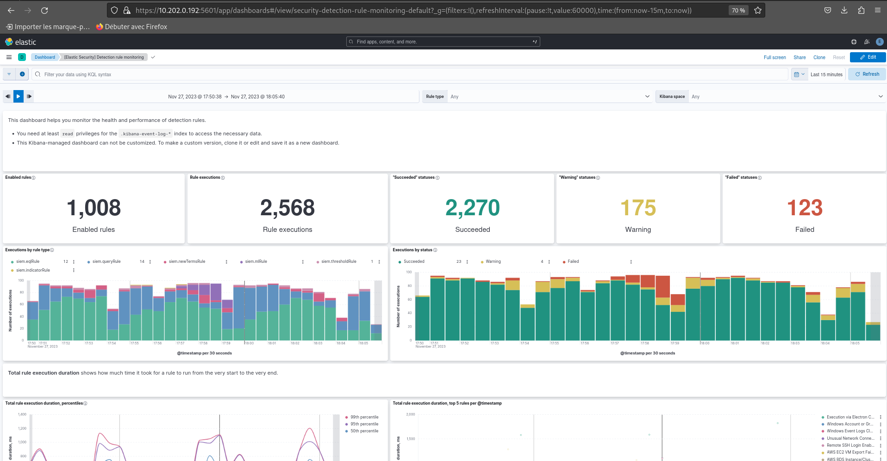

# Installation des agents Elastic 

### Installation non automatisé :  

#### Création d'un fleet server et des outputs 

Récupérer avec les commandes :  

    make fgprint 
    make prca

#### Création de 2 policy : 
- PolicyDCWindows pour le DC01,DC02 et DC03
- PolicySRVWindows pour le SRV02 et SRV03

### Mise en place des agents  

SuR LES dc

    $ProgressPreference = 'SilentlyContinue'
    Invoke-WebRequest -Uri https://artifacts.elastic.co/downloads/beats/elastic-agent/elastic-agent-8.9.0-windows-x86_64.zip -OutFile elastic-agent-8.9.0-windows-x86_64.zip
    Expand-Archive .\elastic-agent-8.9.0-windows-x86_64.zip -DestinationPath .
    cd elastic-agent-8.9.0-windows-x86_64
    .\elastic-agent.exe install --url=https://10.202.0.192:8220 --enrollment-token=RHVSSkVJd0JLSnRGUVB1OFBnajc6V1ZBQzZoZk9TeXl1V2ZDakMxalZxZw==

Sur les SRV(s):

    $ProgressPreference = 'SilentlyContinue'
    Invoke-WebRequest -Uri https://artifacts.elastic.co/downloads/beats/elastic-agent/elastic-agent-8.9.0-windows-x86_64.zip -OutFile elastic-agent-8.9.0-windows-x86_64.zip
    Expand-Archive .\elastic-agent-8.9.0-windows-x86_64.zip -DestinationPath .
    cd elastic-agent-8.9.0-windows-x86_64
    .\elastic-agent.exe install --url=https://10.202.0.192:8220 --enrollment-token=YU9UcEVJd0JLSnRGUVB1OHdGVko6M0EzeC1rWU9RZmFiczBWZGJMeUxhZw==

### Mise en place des intégrations 

- PolicyDCWindows pour le DC01,DC02 et DC03

- PolicySRVWindows pour le SRV02 et SRV03

### Configuration de base de l'intégration Windows 

### Configuration de l'intégration de Elastic defend : 

Mise en place du mode Detect 

 

blocage de la vérification des certificat et hostname par TLS

### Application des règles dans  "Alerts and Insights / Rules"

## Vérification des remontées sans attaques 

Dans [Metrics System] Host overview

	
Dans [Elastic Security] Detection rule monitoring

