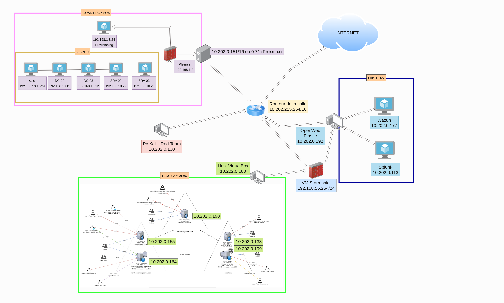
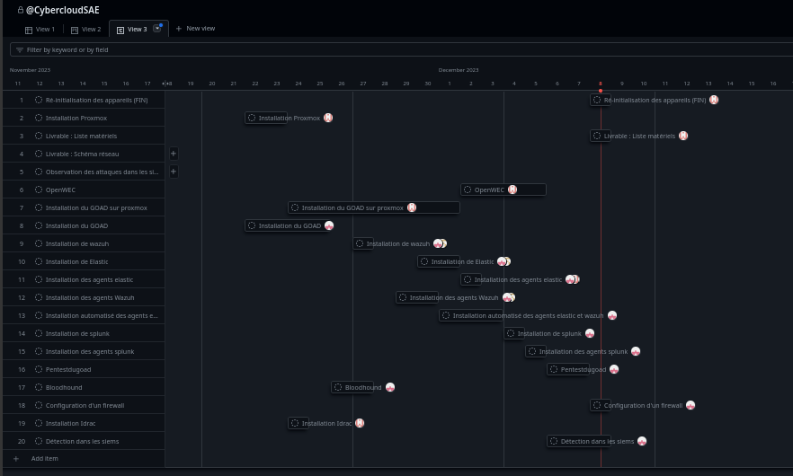

# SAE_Cloud_Cyber

### Le schéma réseaux : 

##### Le matériels utilisées :

Pour pouvoir répondre au cahier des charges nous avons utilisées les matériels suivant : 
2 PC de la salle pour contenir les différentes VM, un server pour acceuilir proxmox  

### Les ressources : 
    
    Le sujet  :  
    https://github.com/pushou/SAE5.Cyber-Devcloud/blob/main/description.md

    L'organisation du projet  trello :
    https://trello.com/invite/b/ZjSyheL4/ATTI8e8909da187ad35a0f2dcdcb13f3da923A1C2DF6/saecybercloud

    L'organisation du projet gihub :
    https://github.com/users/AlexisBrunel/projects/1

### Récapitilatif des réussites

 - Tout d'abord nous avons lancer en parralèle GOAD sur virtualbox et proxmox des le premiers jours. Par la suite nous avons installé les différents SIEM et leur agent ( Wazuh, Elastic, OpenWEC, Splunk). Nous avons utilisé ansible pour automatisé l'installation des agents ( Wazuh, Elastic). Sur Wazuh nous avons mis en place des règles de détections en rapport avec le SOC fortress. Nous avons réaliser une chasse au "virus" grâce à l'outils Hayabusa sur des logs Sysmon. Malheuresement les logs récupérer ne sont pas représentatif étant donné qu'il corresponde à 30 minutes d'activié d'un WINDOWS.
L'équipe cyber à alors crée un plan d'attaque du réseaux pour voir le bon fonctionnement de la détection d'attaque dans les différents SIEM. Nous avons réalisé différentes attaques sur plusieurs service du SI (Kerberos, LDAP, smb et réseau ).
La détection des attaques était assez compliqué, nous n'arrivons pas à déduire le fonctionnement précis de l'attaque. Malgrès l'utilisation d'autre outil tels que wireshark, nous ne pouvons pas comprendre le fonctionnement d'un crackmapexec, il est impossible d'expliquer grâce au SIEM en quoi consite l'attaque. Nous pouvons avoir un bon aperçu de ce qu'il se passe mais pas d'en déduire qu'il s'agit d'un crackmapexec. Nous avons réaliser une attaque de BloodHound en premier ce qu'y nous a permis d'avoir des informations sur les utilisateurs et une cartographie des royaumes kerberos, des domaines et sous domaines.
Cette attaque dans notre cas ne nous semble pas très performante à cause d'un accès en annonyme à l'active directory.
Nous avons mis en place un firewall Stormshield en fin de SAE, le but permettant de contrôler les flux sortant du GOAD vers internet et la DMZ.

###  Points bloquant : 

 - Nous n'avons pas eu assez de temps pour réaliser des tests sur Proxmox malgrès une infrastructure fonctionnelle.
Nous n'avons pas réussis à comprometre l'adminisrateur du domaine dans le pentest, manque de méthodologie, d'entrainement et de pratqique.
Difficulté aux niveaux des configurations OPENWEC. Manque de temps pour la détection des attaques sur elastic, ne n'avons pas réussi à identifier d'information sur l'attaque, il nous est uniquement possible de voir la règles qui se déclenche sur à l'attaque.

### Notre comparatif des SIEMS 
Splunk, beacoup d'information remonté, un système d'analyse en temps réel fonctionnel, permet d'avoir un grand nombre d'information sur des détections, un système de filtrage très simple d'utilisation pour identifier certain patterne.

Elastic, beaucoup de facilité de mise en place, un système d'intégration assez simple et complet, malgrès cela nos test ne sont pas très valorisant car les intégrations utilisé ne nous permette pas de comprendre une détection.En effet l'application prévient mais nous ne savons pas pourquoi. Peut être tester avec plus de temps d'autre intégration pour pouvoir poussez les analyses.

Wazuh, une grande surprise, beaucoup de fonctionnalité, un système d'analyse simple pour les filtres mais compliqué pour l'affichage en temps réel. Cette application remonte un grand nombre d'information est simple d'insallation. Pour l'ajout de détection et de protection il possède un système d'insertion de régles très simple(testé avec les règles Soc Fortress). 

Nous recommandons  Elastic pour la supervision des hôtes d'un point de vue fonctionnel, car certaine intégration permette d'avoir des tableaux de bord intuitif. Pour la sécurité Wazuh semble la meilleur sollution, les détections et les l'application est simple d'utilisation. Toutefois nous n'avons pas tester la verion payante de splunk.

###  Les questions :

 - Lors de l'installation d'Open Wec, un problème était survenue lors de la création de la clé, alors une question à été poser à l'enseignant Mr.Pouchoulon, la réponse à été de définir l'utilisateur dans le fichier /etc/openwec/openwec.conf le même domaine que le DC ou le SRV

## Les annexes : 
    - Un dossier Installation 
    - Un dossier Red Team 
    - Un dossier Blue Team 
    - Un dossier Livrables 

#### Dossier Installation 
    - Installation Splunk
    - Installation Elastic
    - Installation Wazuh
    - Installation Openwec
    - Ansible_agent
    - Goad_Virtualbox
    - Installation GOAD Proxmox
    - Elastic agent déploiement 
    - Installation d'un Kali linux pour la redteam
    
#### Dossier Blue Team 
    - Détection des menances dans les siems 
    - Chasse au virus
#### Dossier Red Team 
    - Dossier Bloodhound
    - Attaque sur le goad
    
#### Dossier livrable 
    - Schéma réseau 
    - Un dossier de sauvegarde
    - Un bilan des heures 

## Organisation du projet  : 

#### Quantification du travail :

/!\    Il faut prendre en compte que les étudiants cyber ont eux plus d'heure pour le projet sans compter les abscences ( Ilker abscent 2 jours - 1 jours TP avec Maxime Calves)    /!\
 

Cyber  : 

89 heures passé par les cybers sur le projet : 

    - 20 heures pour le GOAD (virtualbox | durée des téléchargements)
    - 8  heures pour l'installation des siems ( Wazuh | Elastic )
    - 7  heures pour le déploiement des agents ( Wazuh | Elastic )
    - 15 heures pour l'automatisation des agents ( Wazuh | Elastic | Installation du GOAD)(désinstallation des agents)
    - 15 heures pour l'installation du siem splunk et des agents 
    - 20 heures pour l'attaque du GOAD
    - 20 heures pour la détection des attaques
    - 2 heures pour rattraper le TP Kerberos SSH

Cloud : 

56 heures passé pour le cloud sur le projet :(2 jours d'absence + 1 journnée de TP avec Maxime Calves)

    - 2  heures pour l'installation de proxmox
    - 31 heures pour l'installation du GOAD sur proxmox
    - 18 heures pour openWEC
    - 4  heures compte rendu d'installation et schéma réseau
    - 1  heure  désinstallation proxmox et du GOAD 

15 heures à la masion pour la rédaction des rapports 
2 heures au total pour la réalisation  des dayly(s)

 

#### Partage du travail :
Pour partager les différentes tâches nous avons utilisées un trello et organiser des dailys, pour pouvoir répartir les tâches nous avons utiliser la méthode Kanban ( A faire | En cours | Fini )
 
Dans un premier temps on a du lister toute les différentes tâches pour quantifier et s'organiser au mieux dans la priorité des différentes tâches ( par exemple commencer par GOAD sur Virtualbox car l'installation était plus rapide ).
 
Le lien vers le trello : https://trello.com/b/ZjSyheL4/saecybercloud
 
 

#### Les livrables :
Tout les livrables sont disponibles sur le github : https://github.com/AlexisBrunel/SAE_Cloud_Cyber/edit/main/README.md (en public)
https://github.com/users/AlexisBrunel/projects/1
