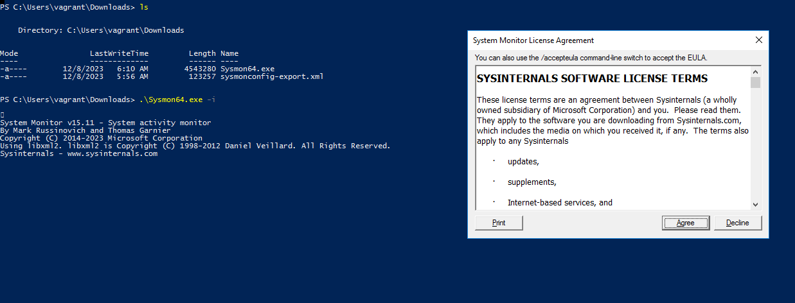
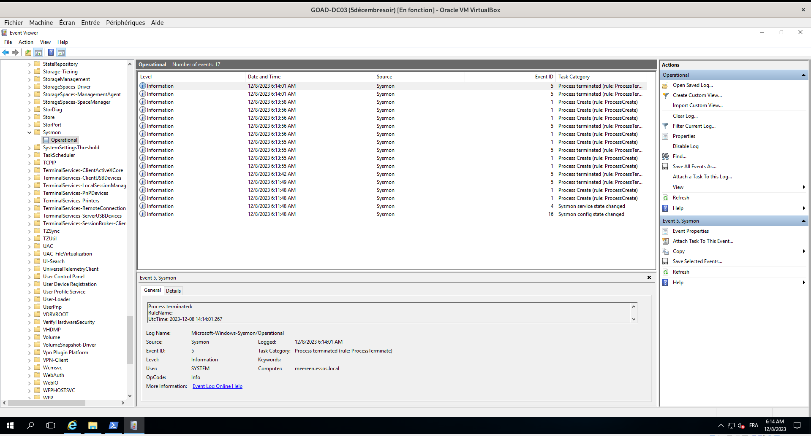
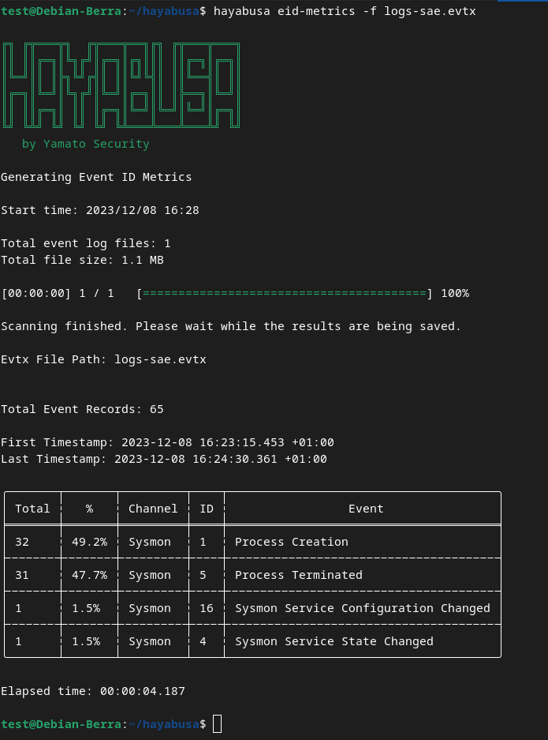

# Sysmon
<br>

### Afin de remonter d'avantage de logs sur les machines du GOAD nous avons installé sysmon sur les machines:

<br>

Après avoir télécharger le fichier **Sysmon.zip** sur le site de Microsoft puis l'avoir *décompressé* j'ai exécuté la commande :
```python
  Sysmon64.exe -i
```


<br>
<br>
#### Nous voyons bien des logs dans l'event viewer de la machine :



<br><br>

# Hayabusa

## Installation et utilisation de hayabusa

Après avoir téléchargé le binaire sur moodle : 

```bash
  git clone https://github.com/Yamato-Security/hayabusa.git --recursive
  sudo cp Téléchargements/hayabusa /usr/local/bin/hayabusa
  sudo chmod +x /usr/local/bin/hayabusa
  cd hayabusa/
  cp ../Téléchragements/logs-sae.evtx ../hayabusa
  hayabusa eid-metrics -f logs-evtx
```

<br><br> 


